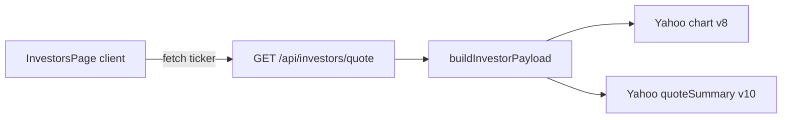

# PRD: Investor Snapshot — Data Source & API Contract (Vercel)

> Status: **DRAFT** — Pending Alex approval  
> Created: 2026-04-19  
> Created by: Cursor Agent  
> Source spec: `SPECS/inbox/feature-investor-snapshot-data.md`  
> Feature ID: `investor-snapshot-data`  
> Related PRD: `SPECS/outbox/investor-intelligence-browser-prd.md` (product framing; **do not** implement Python/yfinance on Vercel)

---

## Executive Summary

The **Investor snapshot** experience at `/investors/` must run on **Vercel serverless Node**—**no Python subprocess**, no reliance on local scripts. The inbox asked to **pick a source**, defaulting to **Yahoo Finance HTTP APIs** callable from Route Handlers.

**Current implementation (baseline):** `GET /api/investors/quote` in `src/app/api/investors/quote/route.ts` calls `buildInvestorPayload` in `src/lib/investors/yahoo-finance.ts`, which fetches:

- **Chart API** — `query1.finance.yahoo.com/v8/finance/chart/{ticker}` with `events=div|split` for dividends, splits, and meta price fields.  
- **Quote summary** — `v10/finance/quoteSummary/...` with modules `summaryProfile,price,summaryDetail,calendarEvents` for sector, refined price/change %, dividend rate/yield, ex-dividend and earnings hints.

Caching is an **in-memory `Map`** inside the route (5-minute TTL per ticker). Errors map to **400** (missing/invalid), **404** (not found), **502** (upstream).

This PRD **codifies that architecture for approval**, documents **gaps vs the original inbox DTO**, and lists **hardening** tasks (CDN caching, observability, contract stability) so Alex can sign off on “good enough for v1” vs “must align JSON shape exactly.”

---

## User Story

**As a** user on the Investor snapshot page  
**I want** reliable **dividend, split, price, and calendar** readouts for a ticker  
**So that** I can sanity-check cash return and event timing **without** the app depending on unsupported Python tooling on Vercel.

---

## Design Specification

### User-facing behavior

- **Search:** User submits a ticker → loading skeletons → cards fill or a **single clear error** (`role="alert"`) on failure (already in `src/app/investors/page.tsx`).  
- **Disclaimer:** Keep visible copy that data is **third-party and delayed** (already present).  
- **Warnings:** When quote summary fails, `warnings` can include a user-visible line (see Technical).

### States

- **Loading:** Existing skeletons on quote, dividend, split, upcoming cards.  
- **Partial data:** Chart works but quote summary fails → dividends/splits/price from chart; calendar/metrics may be missing—**surface** `warnings` in UI (implementation task if not already).  
- **Error:** Invalid ticker, not found, upstream failure—no uncaught exceptions.

---

## Technical Specification

### Canonical data flow



### Response type (actual — `src/lib/investors/types.ts`)

```ts
export type InvestorTickerResponse = {
  ticker: string;
  fetchedAt: string;
  quote?: { name?: string; price?: number; changePct?: number; sector?: string; exchange?: string };
  dividends: Array<{ date: string; amount: number }>; // last 5, chart-derived
  splits: Array<{ date: string; ratio: string }>; // up to 8 recent, chart-derived
  calendar?: { exDividendDate?: string; earningsDate?: string };
  metrics?: { dividendRate?: number; dividendYield?: number }; // yield stored as percent (×100) when from Yahoo raw—verify UI formatting
  warnings: string[];
};
```

### Gap vs inbox “expected interface”

The inbox listed a flat shape (`currentPrice`, `previousClose`, `change`, `nextExDivDate`, …). The **live API** nests quote fields under `quote`, calendar under `calendar`, and uses **`changePct`** rather than separate change / changePercent. **Decision for implementation:**

- **Option A (recommended):** Treat **`InvestorTickerResponse` as the canonical contract**; update any stale docs to match; frontend already uses it.  
- **Option B:** Add a **versioned** DTO or `v=2` query param that matches the inbox literally—only if a downstream consumer requires it.

### Caching & performance

| Layer | Today | Target / hardening |
|-------|--------|---------------------|
| Route handler | In-memory `Map`, 5 min TTL | **Keep** for single-instance warm paths; document that **per-instance** cache is not shared across Vercel isolates. |
| HTTP | Not set on `NextResponse` | Add **`Cache-Control: s-maxage=300, stale-while-revalidate`** (or Next `revalidate` pattern) so **CDN** can cache GET responses where acceptable. |
| `fetch` in lib | `next: { revalidate: 0 }` on Yahoo calls | Revisit: **origin** fetches may ignore CDN if always `no-store`; align with product for **5 min** freshness vs live quotes. |

### Resilience

- **User-Agent:** Custom UA string is already set on Yahoo requests—keep honest and contactable.  
- **Rate limits / blocks:** Map to `502` + user message; optional **retry with backoff** for idempotent GET (one retry max).  
- **Invalid input:** `normalizeTicker` + regex guard—already returns `INVALID_TICKER`.

### Security & compliance

- **No secrets** in repo for Option A.  
- Log **tickers** sparingly in server logs if needed for ops; avoid PII.  
- Document **Yahoo** as third-party dependency; no warranty on availability.

---

## Implementation Plan (hardening beyond baseline)

1. **Document** in README or `SPECS/` pointer: data source = Yahoo chart + quoteSummary (this PRD).  
2. **HTTP cache headers** on `GET` success responses (300s).  
3. **UI:** Render `warnings[]` when non-empty (dismissible optional).  
4. **Metrics:** Confirm `dividendYield` display matches Yahoo units (code multiplies raw by 100 in one path—verify `formatPct` / labels).  
5. **Optional fallback:** If chart endpoint fails, optional second provider (Alpha Vantage, etc.) **out of scope** unless Alex approves API keys + billing.

---

## Acceptance Criteria

- [ ] `/investors/` loads real **dividend** and **split** data for liquid US symbols (e.g. AAPL, MSFT, JPM) via **server-side Yahoo** fetch (no Python).  
- [ ] **Price** and **day change %** shown when Yahoo returns them.  
- [ ] **Ex-dividend** and **earnings** rows populated when quote summary returns calendar fields; graceful **—** when missing.  
- [ ] **Invalid / unknown ticker:** clear **400/404** messaging, no white screen.  
- [ ] **Caching:** at least one of: **5 min in-route memory** (existing) **or** **CDN `s-maxage=300`** after hardening—Alex to confirm “both” ideal.  
- [ ] **Contract:** Either document canonical `InvestorTickerResponse` **or** implement inbox-flat DTO with explicit migration plan.  
- [ ] `npm run lint` and `npx tsc --noEmit` pass.  
- [ ] **Vercel:** merge to `main` and verify production (`SPECS/HANDOFF-OPENCLAW-GOOP-VERCEL.md`).

---

## Verification Steps

1. `curl` or browser: `/api/investors/quote?ticker=AAPL` — JSON matches schema, `fetchedAt` ISO string.  
2. `/investors/` manual test: AAPL, bogus ticker, airline mode slow network (loading states).  
3. `npm run lint`, `npx tsc --noEmit`.  
4. After deploy: smoke test production URL.

---

## Related

- Inbox: `SPECS/inbox/feature-investor-snapshot-data.md`  
- Code: `src/app/api/investors/quote/route.ts`, `src/lib/investors/yahoo-finance.ts`, `src/lib/investors/types.ts`, `src/app/investors/page.tsx`  
- Hosting: `SPECS/HANDOFF-OPENCLAW-GOOP-VERCEL.md`
